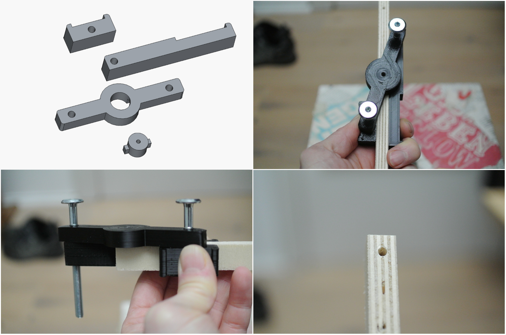

# Self-centering Drill Guide

## Features

- It works close to edges
- Can be hold with one hand comfortably
- Can be clamped to the workpiece for a handsfree workflow
- Changable inserts to support different drill bit diameters
- Insert- as well as the bolt diameter can be changed easily via parameters

# 

## Usage

Aligning the tool correctly can be hard. This is espacilly true for holes with smaller diameters
since it's hard to spot a marking through the hole. To overcome this issue i wrote a python script
which allows you to calculate a marking position that can be aligned with the handles outer edge.

Say you want to drill a hole 10 mm away from the edge of a piece of plywood with a thickness of 12 mm.
You can invoce the script with those parameters:

```
$ ./drill-guide.py -d 10 -m 12

Material thickness: 12.0, Hole distance from edge: 10.0
Alignment mark: 67.7 mm
```

Place the marking 67.7 mm away from the edge, align the longer handles edge with the marking
and the hole will be positioned exactly 10 mm away from the edge.

## BOM

- M6 Bolts (can be changed via parameters)
- PLA for printing the parts

## Assemblby

1. Print all the parts as shown on the picture. The [prerendered STL files](STL) use the defaults parameters (3 mm drill hole, M6 bolts).
2. The holes for the bolts are .5 mm smaller than the actual diameter of the bolts. They cut a thread into the part when screwed in. Make sure to align the top part with the clamp part
when the bolts are screwed in so there is no gap between the top and the clamp.

## Customization

You can cusomitze the drill bit diameter of the insert as well as the diameter of the bolts use to connect all parts.
The corresponding parameters can be found inside the spreadsheet.
